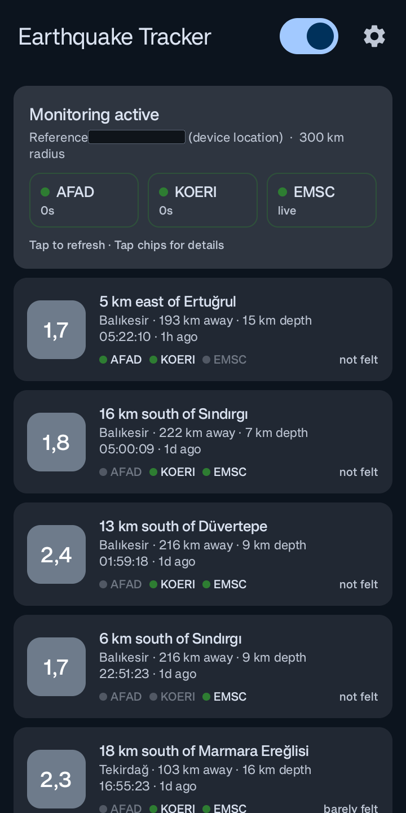
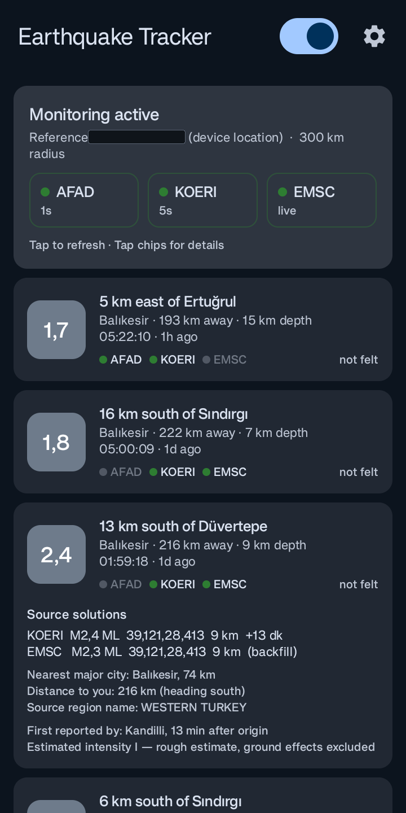
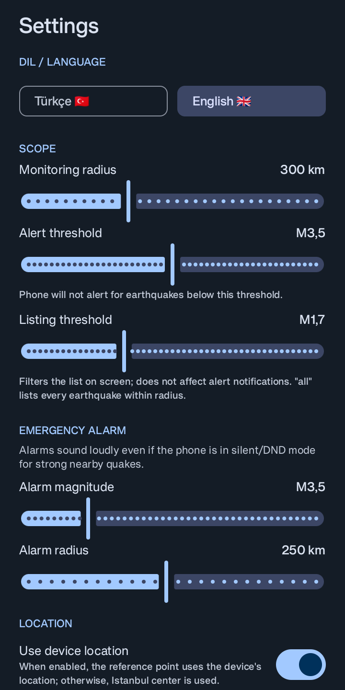
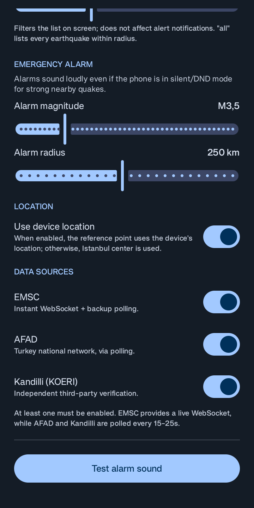

# ⚡ Deprem Takip (Earthquake Tracker)

[-green.svg)](https://developer.android.com)
[](https://kotlinlang.org)
[](https://developer.android.com/jetpack/compose)
[](../LICENSE)

> 🇬🇧 **[Click here for English Documentation (README.md)](../README.md)**

İstanbul veya seçtiğiniz herhangi bir konum çevresindeki depremleri **EMSC** (canlı küresel WebSocket), **AFAD** (T.C. İçişleri Bakanlığı Afet ve Acil Durum Yönetimi Başkanlığı) ve **Kandilli Rasathanesi (KOERI)** kaynaklarından eş zamanlı olarak izleyen, ultra düşük gecikmeli açık kaynaklı Android uygulaması.

Uygulama **sıfır bekleme (zero-wait)** prensibiyle çalışır: Depremi ilk hangi kaynak duyurursa bildirimi anında telefonunuza gönderir; diğer kaynakların çözümleri geldikçe mevcut bildirimi sessizce günceller ve arayüzdeki rozetleri (`AFAD ✓ · KOERI ✓ · EMSC ✓`) tamamlar.

---

## 📱 Ekran Görüntüleri

| 1. Canlı Akış & Durum | 2. Çoklu Kaynak Çözümleri |
| :---: | :---: |
|  |  |
| Gerçek zamanlı WebSocket durumu, kaynak doğrulama rozetleri, göreli mesafeler ve cihaz üzerinde hesaplanan yerleşim yeri yönü. | Karta dokunulduğunda açılan ajans çözümleri (AFAD, KOERI, EMSC), ilk haber verme gecikmesi, en yakın il merkezi ve tahmini sarsıntı şiddeti. |

| 3. Kapsam & Alarm Ayarları | 4. Kaynaklar & Tanılama |
| :---: | :---: |
|  |  |
| Dil seçimi (Türkçe 🇹🇷 / English 🇬🇧), izleme yarıçapı, bildirim eşiği, liste eşiği ve yüksek sesli acil durum alarmı ayarları. | Gerçek zamanlı GPS/cihaz konumu anahtarı, bağımsız kaynak açma/kapama (EMSC, AFAD, KOERI) ve alarm sesi test butonu. |

---

## ✨ Öne Çıkan Özellikler

- **⚡ Sıfır Gecikmeli Bildirim Motoru**: Üç kaynağın uzlaşması beklenmez (uzlaşma beklemek 30–60 saniye kaybettirir). İlk gelen veriye göre anında bildirim düşer. Diğer kaynaklar doğruladıkça bildirim *ikinci kez telefonunuzu çaldırmadan* sessizce güncellenir.
- **🛡️ Akıllı Olay Eşleştirme ve Çift Gösterim Engelleme (`QuakeStore`)**:
  - Gelen çözümler için dinamik **30 saniyelik zaman penceresi** kullanılır.
  - Büyüklükle genişleyen mesafe toleransı ($M2 \rightarrow 45\text{ km}$, $M6 \rightarrow 105\text{ km}$) sayesinde aynı deprem için birden fazla kart oluşturulmaz; artçı sarsıntılar ise bağımsız olarak ayrıştırılır.
- **📍 %100 Çevrimdışı Yerleşim ve Yön Veritabanı**:
  - Türkiye'deki **15.000'den fazla il, ilçe ve köyün** koordinatlarını içeren yerel veritabanı (`assets/yerlesimler.tsv`).
  - Depremin merkez üssünü harici hiçbir internet servisine ihtiyaç duymadan cihaz üzerinde hesaplar (örneğin: *"Düvertepe'nin 13 km güneyinde"* / *"13 km south of Düvertepe"*).
- **🚨 Rahatsız Etmeyin (DND) Modunu Delen Acil Alarm**:
  - Belirlediğiniz eşiğin üzerindeki yakın depremlerde ($M \ge \text{eşik}$, alarm yarıçapı içinde), telefonunuz sessizde veya "Rahatsız Etmeyin" modunda olsa dahi yüksek sesli alarm çalar.
- **🔋 Kesintisiz Arka Plan Servisi**:
  - Android 14/15 kısıtlamalarına tam uyumlu ön plan servisi (Foreground Service), kısmi wake lock, telefon açılışında otomatik başlama (`BOOT_COMPLETED`) ve WorkManager kurtarma ağı ile 7/24 kesintisiz izleme.
- **🌐 Çift Yönlü Dil Desteği**:
  - Arayüzden tek dokunuşla geçiş yapılabilen **Türkçe 🇹🇷** ve **İngilizce 🇬🇧** dil desteği.

---

## 🚀 Veri Kaynakları Nasıl Çalışır?

| Kanal | Yöntem | Tipik Gecikme | Notlar |
|---|---|---|---|
| **EMSC** | Kalıcı **WebSocket** (`wss://seismicportal.eu/standing_order/websocket`) | Anında (< 1 sn) | Küresel yayın yapar; uygulama yarıçapınıza göre filtreler |
| **AFAD** | HTTP REST Yoklama (15 sn'de bir) | $\le 15\text{ sn} + \text{ağ süresi}$ | Türkiye ulusal sismoloji ağı |
| **Kandilli (KOERI)** | HTTP Ayna Yoklama (25 sn'de bir) | $\le 25\text{ sn} + \text{ağ süresi}$ | Boğaziçi Üniversitesi Bölgesel Deprem-Tsunami İzleme Merkezi |
| **EMSC Yedek** | HTTP FDSN Yoklama (90 sn'de bir) | Yedek Kanal | WebSocket bağlantısı koptuğunda veri kaybını önler |

---

## 📥 Adım Adım Kurulum Rehberi

### Yöntem 1: Hazır APK Kurulumu (Kullanıcılar İçin Önerilen)

1. **APK Dosyasını İndirin**:
   - Bu reponun sağ tarafındaki [Releases](https://github.com/swartz13/Earthquake-Tracker/releases) (Sürümler) sayfasına gidin.
   - En güncel imzalı APK dosyasını (`DepremTakip-vX.X.apk`) telefonunuza indirin.
2. **Bilinmeyen Kaynaklara İzin Verin**:
   - İndirilen APK'ya dokunduğunuzda Android bir güvenlik uyarısı gösterecektir.
   - **Ayarlar**'a gidin ve tarayıcınız / dosya yöneticiniz için **"Bu kaynaktan yüklemeye izin ver"** seçeneğini etkinleştirip **Yükle** düğmesine basın.
3. **Gerekli İzinleri Verin**:
   - **Bildirim İzni**: Depremleri anında alabilmeniz için zorunludur.
   - **Konum İzni**: Ayarlarda "Cihaz konumunu kullan" seçeneğini açarsanız, bulunduğunuz şehre/noktaya göre mesafe hesaplanabilmesi için gereklidir.
4. **⚠️ ÇOK ÖNEMLİ: Pil Optimizasyonunu Kapatın**:
   Android işletim sistemi arka planda sürekli internete bağlı kalan uygulamaları pil tasarrufu gerekçesiyle durdurabilir. Kesintisiz bildirim alabilmek için telefon markanıza uygun ayarı yapın:
   - **Xiaomi / Redmi / POCO (MIUI / HyperOS)**:
     - Uygulama simgesine basılı tutun $\rightarrow$ **Uygulama bilgisi** $\rightarrow$ **Pil tasarrufu** $\rightarrow$ **Kısıtlama yok** seçin.
     - **Otomatik başlatma** iznini açın.
   - **Samsung (OneUI)**:
     - Ayarlar $\rightarrow$ Uygulamalar $\rightarrow$ Deprem Takip $\rightarrow$ **Pil** $\rightarrow$ **Kısıtlanmamış** seçin.
     - "Derin uykudaki uygulamalar" listesinde olmadığından emin olun.
   - **OPPO / Realme / OnePlus (ColorOS / OxygenOS)**:
     - Uygulama simgesine basılı tutun $\rightarrow$ **Uygulama bilgisi** $\rightarrow$ **Pil kullanımı** $\rightarrow$ **Arka plan etkinliğine izin ver** ve **Otomatik başlatmaya izin ver** seçeneklerini açın.
   - **Huawei / Honor (EMUI / MagicOS)**:
     - Ayarlar $\rightarrow$ Uygulamalar $\rightarrow$ Uygulama başlatma $\rightarrow$ Deprem Takip uygulamasını **Elle yönet** yapıp her üç anahtarı da (*Otomatik başlatma*, *İkincil başlatma*, *Arka planda çalışma*) açık bırakın.
5. **Alarm Sesini Test Edin**:
   - Uygulama içinde sağ üstteki **Ayarlar** (dişli çark) simgesine dokunun $\rightarrow$ En alttaki **Alarm sesini test et** butonuna basarak acil durum hoparlör kanalını doğrulayın.

---

### Yöntem 2: Kaynak Koddan Derleme (Geliştiriciler İçin)

#### Gereksinimler
- JDK 17 veya üzeri
- Android SDK (Platform API 35 ve Build-Tools 35.0.0)
- Git

#### Derleme ve Çalıştırma Adımları

```bash
# 1. Projeyi klonlayın
git clone https://github.com/swartz13/Earthquake-Tracker.git
cd Earthquake-Tracker

# 2. Debug APK derleyin
./gradlew assembleDebug

# 3. USB ile bağlı telefonunuza kurun
./gradlew installDebug

# 4. Birim testlerini çalıştırın (Ayrıştırma, kümeleme ve yön hesaplayan 27 birim testi)
./gradlew test
```

> **İmzalama Notu**: 
> Release yapıları kök dizindeki `keystore.properties` dosyasını arar. Bu dosya yoksa derleme kırılmaz, imzasız (unsigned) release çıktısı üretilir.

---

## ⚙️ Ayarlar Rehberi

| Ayar | Varsayılan | Açıklama |
|---|---|---|
| **Dil / Language** | Türkçe / English | Uygulamadaki tüm başlıkları, pusula yönlerini ve bildirimleri anında seçili dile çevirir. |
| **İzleme Yarıçapı** | 300 km | Bu mesafenin dışında kalan depremleri listelemez ve bildirmez. |
| **Bildirim Eşiği** | M3.5 | Telefonunuza bildirim gönderilmesi için gereken minimum büyüklük. |
| **Liste Eşiği** | M1.7 | Ana ekrandaki kart listesini filtreler; bildirim ayarını etkilemez. |
| **Acil Durum Alarmı** | M3.5 · 250 km | Belirlenen kriterdeki şiddetli ve yakın depremlerde sessiz modu delen siren çalar. |
| **Konum** | Cihaz Konumu | Çoklu sağlayıcılı (GPS + Ağ + Fused) anlık konum belirleme; kapalı alanda son bilinen konumu kullanır. |
| **Veri Kaynakları** | EMSC, AFAD, Kandilli | İstediğiniz sismik ağı bağımsız olarak açıp kapatabilmenizi sağlar. |

---

## 🏛️ Mimari ve Proje Yapısı

```
app/src/main/java/com/berk/deprem/
├── model/
│   └── Quake.kt                 # Report (tek kaynak çözümü) ve Quake (birleştirilmiş olay modeli)
├── core/
│   ├── AlertPolicy.kt           # Bildirim, alarm veya sessiz güncelleme karar motoru
│   ├── Geo.kt                   # Büyük daire mesafesi, pusula yön açısı, MMI şiddet hesabı
│   ├── Places.kt                # 15.342 yerleşim yeri coğrafi indeksi ve dinamik başlık üretici
│   ├── Prefs.kt                 # Kalıcı kullanıcı ayarları
│   ├── QuakeStore.kt            # Çoklu ajans eşleştirme ve de-duplication (tekilleştirme) motoru
│   └── Repo.kt                  # Ağ, depolama ve servis durumunu yöneten merkezi havuz
├── data/
│   ├── EmscWebSocket.kt         # Üstel geri çekilmeli (exponential backoff) kalıcı WebSocket istemcisi
│   ├── Sources.kt               # AFAD, Kandilli ve EMSC HTTP ayrıştırıcıları
│   └── Time.kt                  # ISO 8601, UTC ve yerel saat dönüşümleri
├── service/
│   ├── LocationFinder.kt        # Fused + GPS + Ağ sağlayıcılarını birleştiren konum çözücü
│   ├── Notifier.kt              # Android bildirim kanalları, ses öznitelikleri ve düzenleri
│   ├── QuakeMonitorService.kt   # Arka plan servis döngüleri ve soket yönetimi
│   ├── BootReceiver.kt          # Cihaz yeniden başladığında servisi geri getiren alıcı
│   └── Watchdog.kt              # Servisin düşmesini engelleyen periyodik WorkManager bekçisi
└── ui/
    ├── MainActivity.kt          # Compose ana aktivitesi ve ön plan konum kancası
    ├── QuakeScreen.kt           # Reaktif ana ekran, deprem kartları, kaynak çipleri ve tanılama penceresi
    ├── SettingsSheet.kt         # Kapsamlı ayarlar alt çekmece penceresi (Bottom Sheet)
    └── Strings.kt               # Tip güvenli AppStrings arayüzü (Türkçe ve İngilizce)
```

---

## 🔒 Gizlilik ve Batarya Taahhüdü

- **Sıfır Analitik ve Takip**: Kod içinde hiçbir reklam, telemetri, izleme veya analiz kütüphanesi yer almaz.
- **Yerel Konum İşleme**: GPS koordinatlarınız yalnızca deprem merkez üssüne olan mesafeyi cihazınızda hesaplamak için kullanılır. Konum bilginiz **hiçbir sunucuya iletilmez**.
- **Düşük Güç Tüketimi**: EMSC WebSocket teknolojisi sayesinde telefon sürekli HTTP sorguları yapmak yerine sunucudan itme (push) bekler; hücresel radyo uyanmaları en aza indirilmiştir.

---

## ⚠️ Sorumluluk Reddi (Disclaimer)

Bu uygulama **deprem tahmini yapmaz**. Yalnızca *gerçekleşmiş* ve resmi sismoloji ağları (AFAD, Kandilli, EMSC) tarafından ölçülüp yayınlanmış depremleri kullanıcılara mümkün olan en kısa sürede iletir.

---

## 📄 Lisans

Bu proje Apache License 2.0 ile lisanslanmıştır. Detaylar için [LICENSE](../LICENSE) dosyasına bakabilirsiniz.
